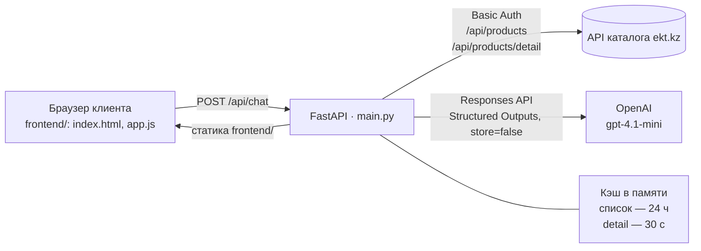

# EKT AI Assistant — ИИ-консультант для сайта ekt.kz

> **HackAlem AI · трек «Торговля»** · кейс ТОО «Электрокомплект»: *«ИИ-ассистент-консультант и помощник для сайта ekt.kz»*

Чат-консультант, который отвечает клиенту ekt.kz по **реальному каталогу EKT**: наличие и остатки по городам, цена, характеристики, аналоги при нулевом остатке. Выбор товара для корзины — **только после явного подтверждения** клиента в отдельном окне, с повторной проверкой остатка на сервере.

**Содержание:** [Проблема](#1-проблема-и-для-кого) · [Что реализовано](#2-что-реализовано) · [Как работает](#3-как-работает-решение) · [Технологии](#4-технологии) · [Архитектура](#5-архитектура) · [Запуск](#6-установка-и-запуск) · [Как проверить](#7-как-проверить-решение) · [Данные](#8-данные-и-интеграции) · [Безопасность](#9-безопасность-и-приватность) · [Ограничения](#10-ограничения-текущей-версии) · [Deploy](#11-развёрнутая-версия)

---

## 1. Проблема и для кого

По условию кейса клиенты ekt.kz, чтобы узнать характеристики и сертификаты товара, проверить наличие, найти аналог или уточнить условия покупки, пишут или звонят менеджеру. Решение о покупке затягивается, часть клиентов уходит к конкурентам, а менеджеры тратят время на однотипные вопросы.

**Пользователи:**
- клиент интернет-магазина — частный покупатель или закупщик компании, выбирающий электротехнику;
- косвенно — менеджеры EKT: типовые вопросы о наличии, цене и аналогах закрывает ассистент.

---

## 2. Что реализовано

**Консультация по каталогу**
- Поиск по реальному каталогу EKT (~15 000 товаров) по названию, артикулу и параметрам.
- Актуальный остаток и цена из detail API EKT, остатки по городам и складам.
- Характеристики товара (`properties` и описание из API).
- При нулевом остатке — возможные аналоги **только из товаров в наличии** с кратким обоснованием, почему предложен именно этот товар (`reason`). В интерфейсе аналог помечен и сопровождается напоминанием проверить совместимость.
- Ответ на языке сообщения клиента: русский, казахский, английский. Запросы на казахском и английском переводятся в русский поисковый запрос, потому что каталог EKT русскоязычный.

**Выбор для корзины с подтверждением**
- Ассистент только *предлагает* позиции. Сам по себе ответ модели ничего не выбирает и не меняет.
- Кнопка «Выбрать для корзины» открывает окно: количество, остаток, сумма. Количество больше остатка ввести нельзя. «Отмена» ничего не отправляет.
- «Подтвердить выбор» отправляет `confirm_cart`; сервер **заново** запрашивает остаток у EKT и отклоняет позицию, если остатка не хватает (`409 CART_UNAVAILABLE`).
- Подтверждённые позиции видны в окне «Ваш выбор».

**Защита от недостоверных данных**
- Модель возвращает строгий JSON по Pydantic-схеме (Structured Outputs), а не свободный текст.
- Сервер принимает от модели только ID товаров из показанных ей кандидатов. Аналог без наличия и позиция корзины больше остатка отклоняются.
- В модель передаются только реальные карточки из каталога; `null` означает «неизвестно», а не «есть».

**Интерфейс**
- Чат, карточки товаров, окно «Подробнее», быстрые запросы, повтор при ошибке, «Новый диалог».
- Интерфейс на RU / ҚАЗ / EN, выбор сохраняется в `localStorage`.
- Адаптивная вёрстка для десктопа и телефона, доступность: native `dialog`, фокус, `aria-live`, `prefers-reduced-motion`.
- 11 unit-тестов фронтенда (`npm test`).

### Соответствие must-have кейса

Проверено живыми запросами 23.09.2026.

| # | Требование | Статус | Комментарий |
|---|---|---|---|
| 1 | Наличие, характеристики, сертификаты | ✅ / ⚠️ | Наличие, остатки по городам, цена и характеристики — из API EKT. Сертификатов в API EKT нет, интерфейс пишет «Сертификат не предоставлен в данных каталога» |
| 2 | Аналоги при нулевом остатке | ✅ / ⚠️ | Предлагаются товары в наличии с обоснованием. При запросе по одному артикулу отсутствующего товара аналоги пока не подбираются (см. [ограничения](#10-ограничения-текущей-версии)) |
| 3 | Условия покупки | ⚠️ | Отдельного источника условий оплаты, доставки и минимальной партии в проекте пока нет |
| 4 | Добавление только после явного подтверждения, с учётом остатка | ✅ / ⚠️ | Подтверждение в окне и повторная проверка остатка на сервере. Реальной корзины ekt.kz нет — подтверждается выбор в ассистенте |
| 5 | Прямая ссылка на корзину | ❌ | API корзины ekt.kz не подключён, ссылка не формируется |

### Опциональные пункты

| Пункт | Статус |
|---|---|
| Казахский язык | ✅ интерфейс и ответы |
| Рекомендации сопутствующих товаров | ❌ |
| История диалога для авторизованных | ❌ история живёт только в памяти вкладки |
| Эскалация на менеджера | ❌ |

---

## 3. Как работает решение

### Сценарий пользователя
1. Клиент открывает страницу ассистента и пишет вопрос в свободной форме — например, *«Есть ли в наличии автомат Legrand 027228?»* — или нажимает быстрый запрос.
2. Ассистент отвечает текстом и показывает до 6 карточек товаров: наличие, остаток, цена, ключевые характеристики, пометка «Возможный аналог».
3. Если товара нет в наличии, ассистент предлагает аналоги в наличии и объясняет выбор.
4. Клиент нажимает «Выбрать для корзины», указывает количество и подтверждает. Сервер перепроверяет остаток и возвращает «Выбор подтверждён».

### Что происходит внутри (`POST /api/chat`)
1. Фронтенд отправляет `query`, последние 12 сообщений `history` и пустой `confirm_cart`.
2. Backend берёт каталог из кэша в памяти. При первом запросе загружает все страницы `/api/products` параллельно (4 потока, до 3 повторов на страницу).
3. Определяется язык сообщения. Для EN/KK модель переписывает запрос в короткий русский поисковый запрос, сохраняя артикулы, токи, напряжения и маркировки.
4. Локальный поиск: токенизация, лёгкий стемминг, стоп-слова, оценка совпадений в названии и тексте товара — топ-40 кандидатов.
5. Для топ-20 кандидатов параллельно запрашивается `/api/products/detail`: остаток, склады, характеристики, описание.
6. Модель получает правила и JSON-контекст (запрос, история, язык ответа, кандидаты) и возвращает структуру `answer + products[{product_id, reason, kind}] + cart_items`.
7. Сервер проверяет ответ модели: ID только из кандидатов, аналог — только с остатком > 0, количество в `cart_items` — не больше остатка.
8. Ответ: текст, карточки с обоснованием, статус выбора (`not_requested` / `awaiting_confirmation`), время снимка каталога, предупреждения.
9. Подтверждение идёт отдельным запросом с `confirm_cart`: сервер без вызова модели заново запрашивает detail и либо возвращает `confirmed`, либо `409`.

---

## 4. Технологии

| Слой | Что используется |
|---|---|
| Backend | Python 3.10+, FastAPI, Pydantic v2, httpx, Uvicorn, python-dotenv |
| AI | OpenAI Responses API со Structured Outputs (`responses.parse` + Pydantic-схемы). Модель задаётся `OPENAI_MODEL`, по умолчанию `gpt-4.1-mini` |
| Данные | REST API каталога ekt.kz (Basic Auth), кэш в памяти процесса. Базы данных и векторного поиска нет |
| Frontend | HTML, CSS, JavaScript (ES-модули) **без фреймворков и сборки**. Раздаётся самим FastAPI |
| Тесты | `node:test` — 11 тестов фронтенда. Backend-тестов нет |
| Инфраструктура репозитория | `.env.example`, pre-commit hook `.githooks/pre-commit` + `scripts/check-env.mjs` против коммита `.env` |

Проверено на: Python 3.14.3, fastapi 0.141.1, uvicorn 0.53.0, httpx 0.28.1, openai 3.19.0, pydantic 2.13.5, python-dotenv 1.2.3, Node.js 24.18.0.

---

## 5. Архитектура



### Компоненты

**Backend — `main.py`**
- `Catalog` — загрузка и кэш каталога, параллельная загрузка страниц, detail-запросы для кандидатов (`enrich`).
- `normalize_product` / `normalize_detail` — приведение ответов EKT к модели `Product`.
- `candidates` — локальный поиск по каталогу; `query_for_catalog` — перевод EN/KK-запроса для поиска.
- `ask_model` — вызов OpenAI со строгой схемой `ModelAnswer` и обработкой ошибок API.
- `validate_cart` — проверка позиций: известный товар, без дублей, количество не больше остатка.
- `handle_chat` — сборка сценария; `app.mount("/", StaticFiles(...))` — раздача интерфейса.

**Frontend — `frontend/`**
- `index.html`, `styles.css` — разметка и адаптивные стили.
- `app.js` — чат, карточки, окна «Подробнее», «Подтверждение», «Ваш выбор».
- `ui-model.js` — форматирование цен и характеристик, безопасные ссылки, валидация ответа API.
- `i18n.js`, `locales.js` — RU / ҚАЗ / EN; `api.js` — формирование запроса; `viewport.js` — мобильная клавиатура и safe-area.
- `server.mjs` — альтернативный dev-сервер на Node.js (порт 5173) с прокси `/api/chat` и `/health`.

### API

| Метод | Путь | Назначение |
|---|---|---|
| GET | `/` | Интерфейс чата (статика `frontend/`) |
| POST | `/api/chat` | Консультация или подтверждение выбора (`confirm_cart`) |
| GET | `/health` | Проверка, что сервер жив (не проверяет EKT и OpenAI) |
| GET | `/api/catalog/search?q=…&limit=…&details=…` | Поиск по каталогу без OpenAI |
| POST | `/api/catalog/reload` | Принудительная перезагрузка каталога |
| GET | `/api/catalog/debug`, `/api/catalog/detail-debug?id=…` | Служебные: сырая структура ответов EKT |
| GET | `/docs` | Swagger UI |

Пример запроса и ответа `/api/chat` (сокращено):

```jsonc
// запрос
{ "query": "Есть ли в наличии автомат Legrand 027228?", "history": [], "confirm_cart": [] }

// ответ
{
  "answer": "Автоматический выключатель Legrand 027228 есть в наличии: 23 шт, в Алматы 5 шт, в Нур-Султане 8 шт…",
  "products": [{ "id": "515291", "name": "027228 АВ DRX250 MT 3ф 160А 18ka Legrand (1)",
                 "price": 64920, "currency": "KZT", "stock": 23, "stores": [ … ],
                 "kind": "match", "reason": "Точное совпадение артикула 027228" }],
  "cart": { "status": "not_requested", "items": [], "added_to_cart": false },
  "catalog_checked_at": "2026-09-23T11:58:04Z",
  "warnings": ["Остатки — снимок detail API EKT, не резерв. API корзины ekt.kz не подключён."]
}
```

---

## 6. Установка и запуск

### Что нужно
- Python 3.10+
- Логин и пароль API EKT (`EKT_USERNAME`, `EKT_PASSWORD`) — без них сервер не стартует
- Ключ OpenAI API (`OPENAI_API_KEY`) — без него сервер запускается, но `/api/chat` возвращает `OPENAI_NOT_CONFIGURED`
- Node.js 20+ — только для тестов фронтенда и альтернативного dev-сервера

### Шаги

```bash
git clone https://github.com/BAITC-Hacks/hack-16612d42-mkp22.git
cd hack-16612d42-mkp22

python -m venv venv
# Windows PowerShell:  venv\Scripts\Activate.ps1
# Windows cmd:         venv\Scripts\activate.bat
# macOS / Linux:       source venv/bin/activate

pip install fastapi "uvicorn[standard]" httpx openai python-dotenv pydantic

cp .env.example .env        # Windows: copy .env.example .env
# заполните в .env: OPENAI_API_KEY, EKT_USERNAME, EKT_PASSWORD

uvicorn main:app --port 8000
```

Запускайте `uvicorn` **из корня репозитория**: интерфейс раздаётся из папки `frontend/` по относительному пути.

- Интерфейс: **http://localhost:8000**
- Swagger: http://localhost:8000/docs

### Первый запрос — загрузка каталога
Каталог загружается при первом обращении. По замерам 23.09.2026 это заняло от 6 секунд до ~4,5 минут в зависимости от скорости API EKT. Прогрейте кэш заранее:

```bash
curl "http://localhost:8000/api/catalog/search?q=027228&details=false"
```

После этого список товаров хранится в памяти 24 часа, а остатки для каждого ответа запрашиваются заново.

### Дополнительные переменные `.env`

| Переменная | По умолчанию | Назначение |
|---|---|---|
| `OPENAI_MODEL` | `gpt-4.1-mini` | Модель OpenAI |
| `CORS_ORIGINS` | `localhost` / `127.0.0.1` на портах 5173 и 3000 | Разрешённые origin для отдельного фронтенда |
| `EKT_PER_PAGE` | `500` | Размер страницы при загрузке каталога (≤ 500) |
| `EKT_MAX_PAGES` | `5000` | Предел числа страниц |
| `EKT_CATALOG_WORKERS` | `4` | Потоки загрузки каталога (≤ 8) |
| `EKT_DETAIL_WORKERS` | `8` | Потоки detail-запросов (≤ 16) |

### Альтернатива: отдельный dev-сервер фронтенда

```bash
cd frontend
npm start          # http://localhost:5173, проксирует /api/chat и /health на http://127.0.0.1:8000
```

Адрес backend меняется переменной `BACKEND_URL`.

### Тесты

```bash
cd frontend
npm test           # 11 тестов
npm run check      # синтаксическая проверка JS
```

Защита от коммита `.env`: `git config --local core.hooksPath .githooks` (подробнее — [SECURITY.md](SECURITY.md)).

---

## 7. Как проверить решение

Товары и остатки ниже взяты из живого каталога **на 23.09.2026**. Остатки меняются: перед проверкой их можно уточнить через `/api/catalog/search?q=<артикул>`.

### Через интерфейс (http://localhost:8000)

| # | Что написать или сделать | Что должно произойти |
|---|---|---|
| 1 | «Есть ли в наличии автомат Legrand 027228? Какие характеристики?» | Товар в наличии: 23 шт, остатки по городам (Алматы 5, Нур-Султан 8), характеристики: 3 полюса, 160 А, 400 В, 18 кА. В карточке цена 64 920 ₸ |
| 2 | «Нужен 007886 Диф.авт. 1p+N 16А (30мА) 411002 Legrand. Есть в наличии? Если нет — чем заменить?» | Сообщение, что остаток 0, и аналог в наличии — например, 411002 УЗО АВДТ DX3 16А 30мА Legrand (50 шт), с обоснованием и пометкой «Возможный аналог» |
| 3 | «Добавь в корзину 1000 штук автомата Legrand 027228» | Ассистент сообщает, что доступно только 23 шт, и предлагает 23. Появляется панель подтверждения; без нажатия «Подтвердить выбор» ничего не отправляется |
| 4 | В карточке — «Выбрать для корзины» → количество 2 → «Подтвердить выбор» | Сервер перепроверяет остаток; появляется «Выбор подтверждён», позиция видна в «Ваш выбор». Количество больше остатка ввести нельзя |
| 5 | «Маған 16А автомат керек, қоймада бар ма?» | Ответ на казахском, карточки автоматов 16 А в наличии (например, Schneider 12116) |
| 6 | Переключатель RU / ҚАЗ / EN в шапке | Интерфейс переводится без перезагрузки, введённый текст и история сохраняются |

### Через API (без интерфейса)

В Windows удобнее использовать Swagger: http://localhost:8000/docs → `POST /api/chat` → *Try it out*.

```bash
# вопрос ассистенту
curl -s http://localhost:8000/api/chat -H "Content-Type: application/json" \
  -d '{"query":"Есть ли в наличии автомат Legrand 027228?","history":[],"confirm_cart":[]}'

# подтверждение выбора: 200, cart.status = "confirmed"
curl -s http://localhost:8000/api/chat -H "Content-Type: application/json" \
  -d '{"query":"подтверждаю","history":[],"confirm_cart":[{"product_id":"515291","quantity":2}]}'

# количество больше остатка: 409 CART_UNAVAILABLE
curl -s http://localhost:8000/api/chat -H "Content-Type: application/json" \
  -d '{"query":"подтверждаю","history":[],"confirm_cart":[{"product_id":"515291","quantity":999}]}'

# поиск по каталогу без OpenAI
curl -s "http://localhost:8000/api/catalog/search?q=027228&limit=3"
```

Время ответа `/api/chat` в замерах 23.09.2026 — от 3 до 10 секунд; подтверждение выбора — около 0,3 секунды.

---

## 8. Данные и интеграции

### API каталога ekt.kz
Доступ предоставлен партнёром кейса по Basic Auth; учётные данные хранятся только в `.env`.

| Endpoint | Что берём |
|---|---|
| `GET /api/products?page=N&per_page=500` | Список: `id`, `name`, `article`, `price`, `image`, `url`. Формат ответа `{page, per_page, count, items}` |
| `GET /api/products/detail?id=…` | `quantity` (общий остаток), `stores[{id, name, quantity}]` (остатки по складам), `properties` (характеристики), `description` |

- В каталоге **~15 037 товаров** (31 страница по 500, замер 23.09.2026).
- После последней страницы API EKT снова отдаёт первую. Загрузчик останавливается на неполной странице и отдельно проверяет повтор страниц.
- Характеристики приходят кодами 1С (`NOMINALNYY_TOK`, `KOLICHESTVO_POLYUSOV`, `TORGOVAYA_MARKA` и т. п.) вместе со служебными полями. В текущей версии они передаются как есть.
- В API **нет**: сертификатов, единицы измерения, категорий, условий оплаты и доставки. Поле `KRATNOST_MIN` (кратность) и `RECOMMEND` (рекомендованные товары) в API есть, но пока не используются.
- Используются реальные данные каталога, синтетических данных нет.

### Кэширование
- Список товаров — в памяти процесса 24 часа (`CACHE_TTL`), принудительно обновляется через `POST /api/catalog/reload`.
- Detail (остатки, характеристики) — 30 секунд; при подтверждении выбора запрашивается без кэша.

### OpenAI
- В модель уходят: текст запроса, до 12 предыдущих сообщений, язык ответа и до 20 карточек-кандидатов (не более ~90 000 символов).
- Запросы отправляются с `store=false`. Персональные данные клиента не запрашиваются и не передаются.
- На одно сообщение — 1 вызов модели, для EN/KK — 2 (перевод поискового запроса + ответ).

---

## 9. Безопасность и приватность

- **Корзина и выбор.** Модель не может ничего выбрать или изменить сама: она только предлагает позиции. Сервер принимает от модели только ID из показанных кандидатов и количество не больше остатка. Подтверждение возможно только через окно с явным нажатием «Подтвердить выбор», после чего остаток проверяется повторно.
- **Персональные и платёжные данные** не запрашиваются и не хранятся. Backend не хранит диалоги; история живёт только в памяти вкладки браузера.
- **Секреты** — только в локальном `.env` (в `.gitignore`); в репозитории — пустой `.env.example`, pre-commit hook против коммита `.env`, порядок действий при утечке — в [SECURITY.md](SECURITY.md).
- **Фронтенд** выводит данные API только через `textContent` (без `innerHTML`), пропускает только абсолютные `http(s)`-ссылки без встроенных учётных данных.
- **Ошибки** возвращаются кодами (`EKT_TIMEOUT`, `OPENAI_LIMIT`, `CART_UNAVAILABLE`…) без трассировок, ключей и тел ответов внешних API.
- CORS ограничен списком origin; dev-прокси `server.mjs` пропускает только `/api/chat` и `/health`.

---

## 10. Ограничения текущей версии

**Корзина**
- Интеграции с корзиной ekt.kz нет: `added_to_cart` всегда `false`, ссылка на корзину не формируется (must-have 5). Подтверждённые позиции хранятся только в окне «Ваш выбор» в памяти вкладки.
- Подтверждение текстом в чате («да, добавь 2 штуки») ненадёжно: каждый запрос ищется заново по тексту нового сообщения, ID ранее показанных товаров в запрос не передаются. Ассистент может не понять, о каком товаре речь, или предложить другой товар; в тексте ответа модель может написать «добавил», хотя без подтверждения в окне ничего не выбирается. Надёжный путь — кнопка «Выбрать для корзины».
- `confirm_cart` не привязан к сессии или к конкретному предложению ассистента.
- Кратность и минимальная партия (`KRATNOST_MIN`) не учитываются.

**Качество ответов**
- Условия оплаты, доставки и минимальной партии: источника данных нет, поэтому ответы модели на такие вопросы не опираются на официальные условия EKT и могут быть неточными.
- Сертификатов в API нет. Интерфейс сообщает об этом, но текст ответа модели может упомянуть сертификат без данных каталога.
- Аналоги подбираются только из выдачи текущего запроса. При запросе по одному артикулу отсутствующего товара аналоги не предлагаются — нужен запрос с названием или параметрами.
- Поиск — по ключевым словам. Разговорные формулировки на русском могут не находить товар: например, «автомат на 16 ампер однополюсный для квартиры» дал ответ «нет в наличии», хотя 12116 АВ (1ф) 16А Schneider есть. Запросы на EN/KK проходят через переписывание моделью и находятся лучше. В выдачу иногда попадают товары другого типа (например, фотореле по запросу «автомат 16А»).
- Остаток `quantity` — сумма всех складов EKT, включая внутренние («Брак MEGALIGHT», «Маркетинг MEGALIGHT», «Образцы Отдел Закупа», «перемещение» и др.).
- Характеристики показываются кодами API, включая служебные поля.
- Единицы измерения в API нет — количество показывается без единицы.
- Язык ответа определяется по тексту сообщения; переключатель RU / ҚАЗ / EN меняет только интерфейс.

**Не реализовано**
- Вложения (фото, Excel, Word, PDF).
- Сопутствующие товары, эскалация на менеджера, история для авторизованных пользователей.
- Встраивание в страницы ekt.kz — ассистент работает как отдельная страница.

**Техническое**
- Ответ — 3–10 секунд; первая загрузка каталога — от 6 секунд до нескольких минут и выполняется синхронно при первом запросе.
- Служебные эндпоинты (`/api/catalog/debug`, `/api/catalog/detail-debug`, `POST /api/catalog/reload`) не закрыты авторизацией; ограничения частоты запросов нет.
- Один процесс, состояние в памяти; при перезапуске каталог загружается заново.
- Backend-тестов нет.

---

## 11. Развёрнутая версия

Развёрнутой версии нет — проект запускается локально (см. [раздел 6](#6-установка-и-запуск)).

---

## 12. Ценность для бизнеса

Ниже — **сценарная модель**, а не измеренный результат: реальных данных обращений EKT у команды нет.

```text
Допущения: 1 000 консультаций в месяц, 70% — типовые (наличие, цена, аналог),
80% типовых закрывает ассистент, 5 минут менеджера на консультацию.

1 000 × 70% × 80% = 560 консультаций без менеджера
560 × 5 мин ≈ 46,7 часа работы менеджера в месяц
```

Фактический эффект считается после пилота по трём данным из CRM/helpdesk: число обращений, доля типовых, среднее время обработки. Для пилота предлагаются метрики: доля запросов с найденным товаром, доля подтверждений только после явного согласия (цель — 100%), время ответа, доля переданных менеджеру; влияние на конверсию — через A/B-тест.

---

## 13. Структура репозитория

```text
main.py                  backend: FastAPI, каталог EKT, поиск, OpenAI, проверка выбора
frontend/                интерфейс чата (раздаётся backend'ом)
  index.html, styles.css   разметка и стили
  app.js                   логика чата, карточек и окон
  ui-model.js              форматирование и валидация данных
  i18n.js, locales.js      RU / ҚАЗ / EN
  api.js, viewport.js      формирование запроса, мобильный viewport
  server.mjs               альтернативный dev-сервер с прокси
  tests/                   тесты node:test
  README.md                подробности по интерфейсу
.env.example             шаблон переменных окружения
SECURITY.md              работа с секретами
.githooks/, scripts/     pre-commit проверка против коммита .env
pres/                    презентация проекта
dump_katalog.py          черновой скрипт выгрузки каталога (не используется, без авторизации)
catalog.json             не используется (содержит ответ API «Unauthorized»)
```

---

## 14. Команда

Участники (по истории коммитов): rizzal1 · Moveath · Squakq
